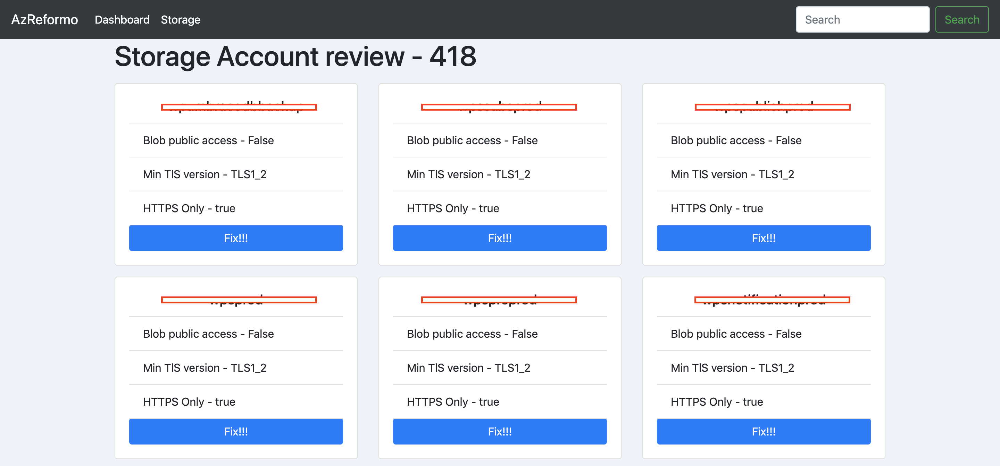
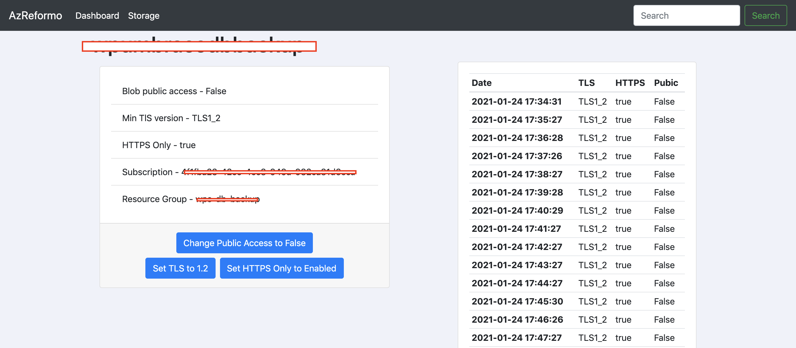

# AzReformo

AzReformo is a tool that aims to give you further transparency into the state of your Azure environments.
In a perfect world, all infrastructure and configurations should be defined as code but this is not a perfect world.

AzReformo also has the functionality to fix miss configured services at the click of a button. We added this functionality
because we know engineers don't always have the opportunity to work with cloud services which are defined as code. We also know 
that sometimes you simply need to make changes quickly to maintain compliance with your organisation.

If you can, we highly recommend making changes to your Cloud services using tools such as [Terrafom](https://www.terraform.io/)
and [Pulumi](https://www.pulumi.com/). We love them and so should you.

Services currently covered:

- [x] Storage Accounts.
- [ ] Virtual Machines.
- [ ] App Services.
- [ ] SQL Services.
- [ ] Azure Key-Vault.

## What does it look like?




## Running AzReformo

``` bash
docker run -d -p 80:80 --env TENANT_ID="" --env CLIENT_ID="" --env CLIENT_SECRET="" azreformo
```

## Setting up for development

1. Create a .env file with the following set (this will not be commited).

``` bash
TENANT_ID=""
CLIENT_ID=""
CLIENT_SECRET=""
```

2. Run

``` bash
docker-compose up
```

## Tech
### Postgres

1. Defaults
    - Username = postgres
    - Password = <set in .env file>
    - Database = postgres
2. Access adminer through localhost:8080

### App setting options

The following app settings can be added to your .env file to manipulate the AzReformo.

``` bash
POSTGRES_PASSWORD="" #Custom password for you postgres database.
APP_DATA_REFRESH=""  #Interval with how often you would like your Azure data to be refreshed.
TENANT_ID=""  #Azure Tenant ID
CLIENT_ID=""  #Azure Client ID
CLIENT_SECRET=""  #Azure Client Secret
```
